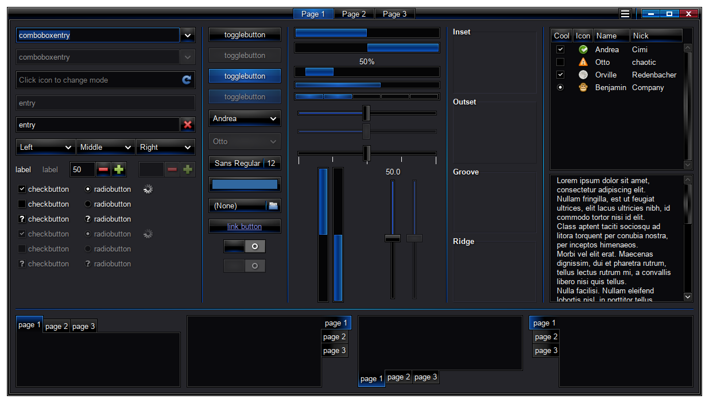
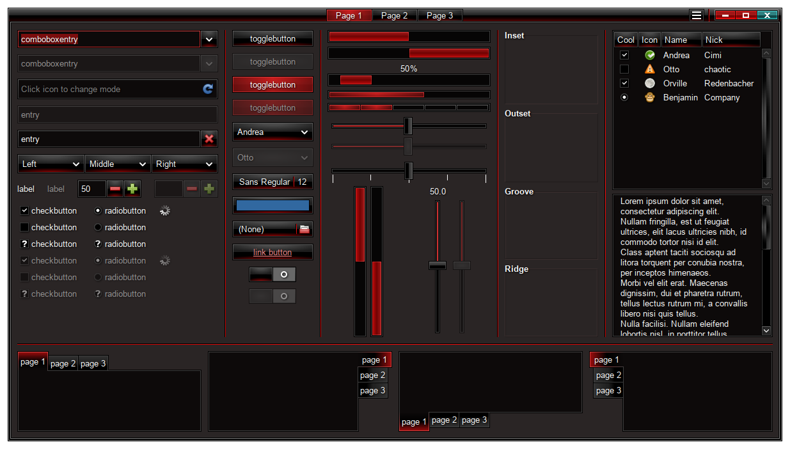

SlickCold and SlickFire GTK3+ Themes
====================================

SlickCold is complete rewrite of OriginalSeed's [DarkCold](https://github.com/originalseed/darkcold) GTK theme from scratch in sass, with some assests reused.
SlickFire is generated from SlickCold based on infinity0's [DarkFire](https://github.com/infinity0/dark-themes) script.

The `gtk-2.0` directory is mostly untouched and is kept for legacy compatibilty.

Previews
========
Below is a preview of the themes in GTK Widget Factory.

SlickCold:

SlickFire:


Installation
============
There are several ways to install:

Local Installation
------------------
```
git clone https://github.com/Mystia-Izakaya/slick-gtk-themes
cd slick-gtk-themes
./generate.sh
mkdir -p ~/.themes
mv SlickCold SlickFire ~/.themes
```

System-wide Installation
------------------------
```
git clone https://github.com/Mystia-Izakaya/slick-gtk-themes
cd slick-gtk-themes
./install.sh
```
This will install the themes to `/usr/share/themes/SlickCold` and `/usr/share/themes/SlickFire`, to uninstall, simply remove these directories.


Alternatively, if the scripts above don't work, then download the latest release and unpack to `/usr/share/themes` (for a system-wide installation) or `~/.themes` (for a local installation).

Recommendations
===============
These themes were designed and tested only on MATE, though feel free to report if anything seems broken on other DEs.

I recommend installing the themes system-wide because GTK application that require root privileges (e.g. GParted, LightDM, ...etc) will not detect the themes if they are installed locally.

For icon themes to use with these themes, I recommend gnome-brave-icons and gnome-wine-icons.

Consider also using [gtk-nocsd](https://codeberg.org/MorsMortium/gtk-nocsd) to remove both GTK4 and GTK3 headerbars, I have tried to theme GTK3 CSD headerbars to match window decorations as much as possible, unfortunately however, some aspects of GTK3 headerbars cannot be manipulated with CSS alone, and headerbars will often look fatter than what they should be.

Extras
======

Theming Firefox and its forks
-----------------------------
A `chrome.css` is generated inside each theme directory, this is meant to be used with with Aris-t2's [Custom CSS for Firefox](https://github.com/Aris-t2/CustomCSSforFx), import it at the end of `userChrome.css`. See that repo for more details on theming Firefox with CSS.

Theming GIMP
------------
GIMP has styles that override the system theme, to fix this create an empty style to be used by GIMP like so:
```
sudo mkdir /usr/share/gimp/3.0/themes/NoOverrides
sudo touch /usr/share/gimp/3.0/themes/NoOverrides/gimp.css
```
Now Open GIMP, go to Edit > Preferences > Interface > Theme > Select NoOverrides and reload your theme.

Theming Inkscape
----------------
Inkscape also tries to override the system theme, however it seems to do so less agressively than GIMP.
Inkscape overrides the system theme by `/usr/share/inkscape/ui/style.css` which is then overriden by `/usr/share/inkscape/ui/user.css`.
For inkscape, the only modification needed is to restore borders around buttons:
```
echo "button { border: solid black 1px; }" | sudo tee /usr/share/inkscape/ui/user.css
```

Emerald themes
--------------
Included is also two emerald themes inside `./emerald-themes` to be used with the Emerald window decorator, import the themes from Emerald Theme Manager. These themes are also based on OriginalSeed's DarkCold emerald theme.
